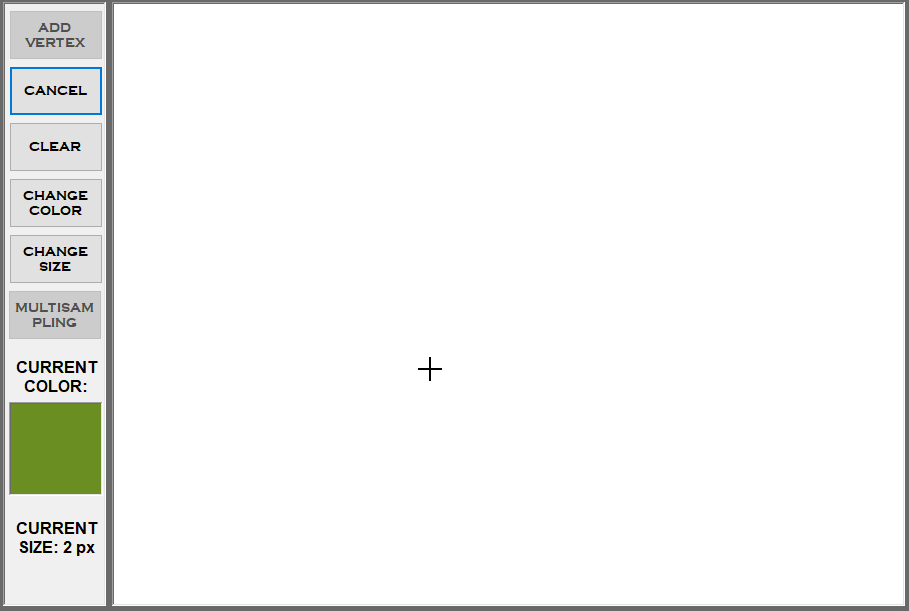
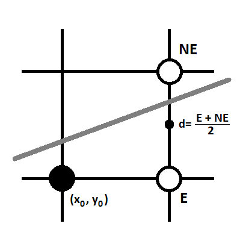

# :art: Simple paint
Simple paint allows you to compose figures from a set of lines and manipulate the created shapes. Every line is drawn pixel by pixel uisng Bresenham algorithm.

## Bresenham's line algorithm
Bresenham's algorithm is a commonly used method for drawing lines. It's operating on integer values, which makes it quick, efficient and simple. Being so fast and cheep for computers to process, Bresenham's algorithm became widely used in many graphics libraries as well as in hardware (plotters, graphic cards). It's possible to extend the algorithm to draw circles as well.

The presented algorithm describes drawing lines for the first octant on the Cartesian Coordinate System.

In each step of the algorithm the `x` coordinate increment is constant `Δx=1`. The Bresenham's algorithm allows to compute the `y` coordinate increment. It can be either the E pixel or the NE pixel.

1. Mark the line's start coordinates as (x0,y0) and (x1,y1)
2.  Compute the overall line's increment of x and y coordinates as `dx` and `dy`
 
	>  
	>  

3. Compute the precise step increment in `y` coordinate and the  E and NE approximations
 
	>  
	>  
	>)  

4. If `d < 0` draw the E pixel, otherwise draw the NE pixel

## :link: Useful links
:art: [Bresenham's algorithm on Wikipedia](https://en.wikipedia.org/wiki/Bresenham%27s_line_algorithm) 

:art: [Bresenham's algorithm described for all octants in Cartesian Coordinate System](https://www.cs.helsinki.fi/group/goa/mallinnus/lines/bresenh.html)
